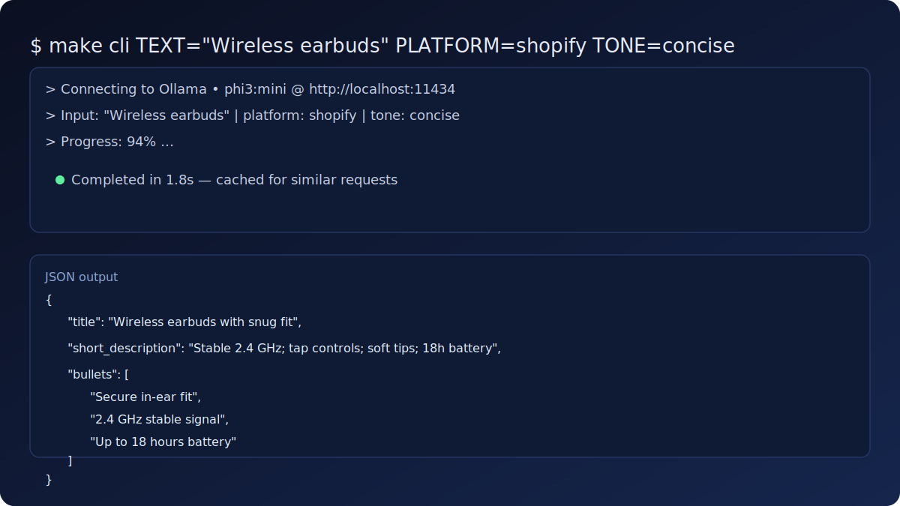
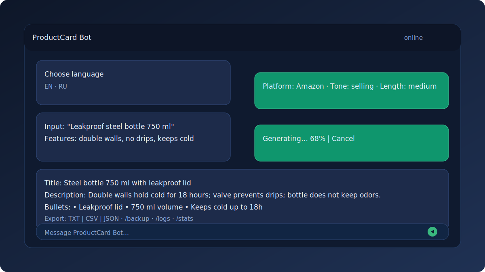
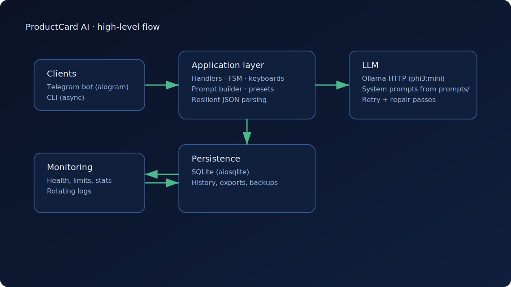

# 🛒 ProductCard AI Bot (Telegram + Ollama) — v1.2.0

Локальный Telegram-бот и CLI, который быстро генерирует **контент-карточку** по короткому вводу:
**заголовок + краткое описание + пункты**.

Работает на локальной LLM через Ollama, хранит последние генерации в SQLite, устойчиво парсит JSON с ретраями.

Паттерн применим не только к товарам: те же шаблоны можно использовать для постов, анонсов и описаний (через пресеты).

## ✨ Что вы получаете
- Telegram-интерфейс: платформа → стиль → длина → ввод → генерация → экспорт/повтор
- CLI для быстрой генерации из терминала
- История последних N генераций (SQLite)
- Устойчивый JSON-парсинг: самовосстановление + ретраи + фолбэки
- RU/EN локализация
- Пресеты категорий (настраиваемые подсказки для промптов)

## 🧪 Пример результата
Одинаковая структура для CLI и бота:

```json
{
  "title": "...",
  "short_description": "...",
  "bullets": ["...", "..."]
}
```

## 🖼️ Скриншоты

CLI: генерация и JSON-вывод.


Telegram: диалог с прогрессом и отменой.


Архитектура и поток данных.

## 🚀 Quick start (3–5 минут)
### Вариант A — Telegram-бот локально
1. Создайте `.env`:
   ```bash
   make env-init
   make env-set KEY=TELEGRAM_BOT_TOKEN VALUE=xxxxxxxx
   ```
2. Убедитесь, что Ollama запущена и модель скачана:
   ```bash
   make ollama-pull   # по умолчанию phi3:mini (можно OLLAMA_MODEL=...)
   ```
3. Запустите бота:
   ```bash
   make bot
   ```

### Вариант B — CLI
```bash
make install
make cli TEXT="Беспроводная мышь Logitech M185" FEATURES="2.4 ГГц, тихие клики" PLATFORM=ozon TONE=neutral
```

## 🐳 Deploy (Docker)
1. Подготовьте `.env` и проверьте:

```
TELEGRAM_BOT_TOKEN=...
LLM_BASE_URL=http://localhost:11434
```

2. Запуск:
```bash
make up
make logs
```

Примечание: контейнер использует `--network host` (Linux). Ollama должна слушать `localhost:11434` на хосте.

## 🔧 Команды и инструменты
- Справка по целям: `make help`
- Проверка окружения: `make doctor`
- Тесты: `make test`
- Просмотр базы SQLite:
```bash
make sql-up   # Datasette UI: http://127.0.0.1:8001 (PORT=... можно переопределить)
make sql-down
```

## 🛡️ Админ-функции (если включены)
Команды требуют `ADMIN_IDS`:
- `/limits`
- `/stats`
- `/backup`
- `/logs`
- `/health`

Также есть:
- ротация логов
- бэкап SQLite и экспорт статистики

## ✅ CI (GitHub Actions)
Workflow Tests запускает `pytest -q` на Python 3.11.

## 📌 Версии и план
- История изменений: CHANGELOG ниже
- Roadmap: `docs/ROADMAP.md` (текущий статус: v1.2)

## CHANGELOG (кратко)
### v1.2.0
- Пресеты категорий (`/preset`), RU/EN
- Админ-команды: `/limits`, `/stats`, `/backup`, `/logs`, `/health` (`ADMIN_IDS`)
- Ротация логов, просмотр последних строк
- Бэкап SQLite и экспорт статистики

### v1.1.2
- Починка CI и тестов, небольшие правки README

### v1.1.1
- GitHub Actions: автотесты на push/PR

### v1.1
- Отмена генерации (кнопка), прогресс 0–100%
- Кэширование результатов с TTL
- Тюнинг под площадки, RU/EN локализация
- Самовосстановление JSON и фолбэки

### v1.0.1
- RU-промпты, запрет markdown/код-блоков в ответе
- Устойчивый парсер JSON, фолбэки

## 📁 Структура проекта
```
app/                 # Config, platforms, presets, system prompts (app/prompts)
bot/                 # aiogram handlers, keyboards, states, localization
services/            # LLM client, card generation, export
storage/             # SQLite repository
docs/screenshots/    # Screenshots and architecture diagrams (SVG)
tests/               # Pytest coverage for generation, DB, and network errors
cli.py               # CLI for local JSON generation
Makefile             # Quick commands (install, bot, cli, test, docker)
.env.example         # Sample settings
```

## 📜 Лицензия
MIT — см. `LICENSE`.
